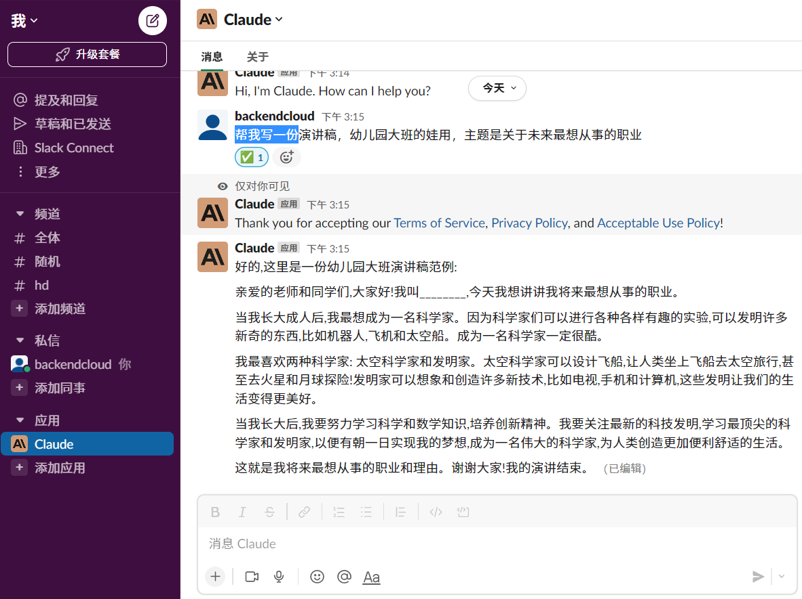
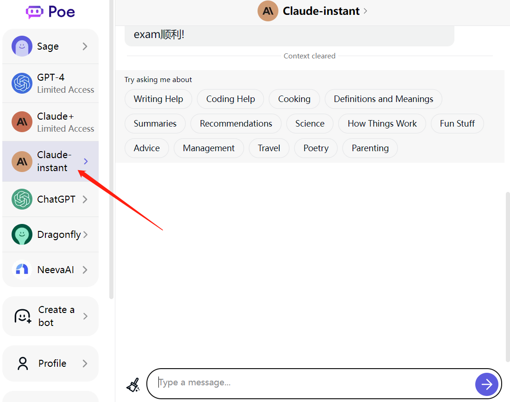

ChatGPT的免费的Web版吐字太慢了，还常常中断，忍无可忍。虽说API调用吐字很快，很顺畅，不会中断，但毕竟是收费的，虽然费用很低。大约500个字人民币一分钱，且OpenAI还会给每个账户送18美元的API体验。但是API终究还是要收费的。

于是，我又找到了ChatGPT一个免费的有力竞品：Claude。Claude用起来太顺畅了，且最近很火，口碑也很好。

下面介绍如何使用Claude，使用Claude比注册ChatGPT要简单得多。两种方式都可以使用Claude，一种是直接使用官方途径，另一种是在第三方平台上使用。

## 官方Slack

Claude的官方Slack地址是：https://slack.com/apps/A04KGS7N9A8-claude

或者搜索引擎搜`slack claude`，第一个就是官方Slack。加入slack后，可以直接使用Claude。

## 第三方平台Poe

Poe是一个集成了包括Claude的很多AI的平台。登陆 [Poe官网](https://poe.com/)

> 上面介绍的两种使用Claude的方式，不仅远远快过Web版的ChatGPT，也远快过API调用的ChatGPT。而且，Claude的输出内容质量也很高。